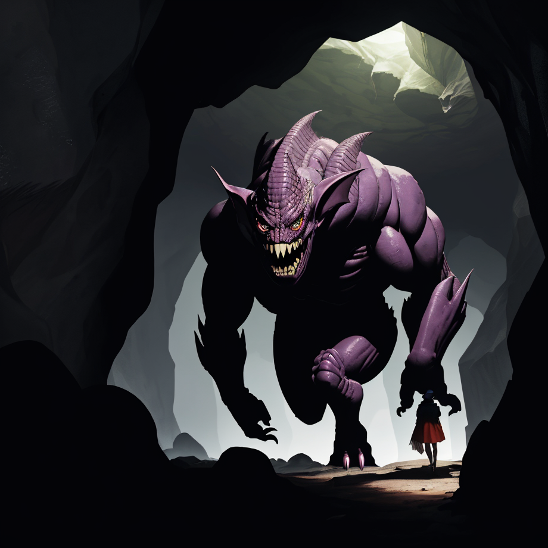
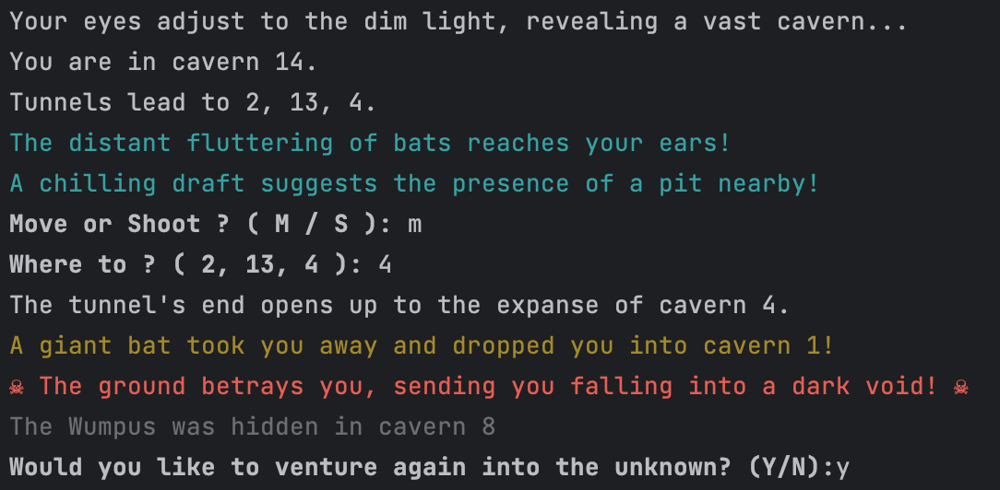

# Wumpus
This is a vanilla go implementation of the 1973 classic text-based computer game first developed by Gregory Yob [Hunt The Wumpus](https://en.wikipedia.org/wiki/Hunt_the_Wumpus).

### Gameplay:

1. **The Cave System**: The game is played in a series of interconnected caves arranged in a dodecahedron. Each of the 20 caves is connected to three other caves.

2. **Hazards**:
   - **The Wumpus**: This is the main antagonist of the game. If you enter the Wumpus's cave, you may get eaten and lose the game. Or the Wumpus may get disturbed and move to another cave.
   - **Pits**: There are two pits in the cave system. Falling into a pit results in instant death.
   - **Giant Bats**: There are two caves with giant bats. If you enter a cave with a giant bat, you will be carried off to a random cave, which might be dangerous.

3. **Player Actions**: On each turn, you can choose to:
   - **Move**: To one of the three connected caves.
   - **Shoot**: You can shoot an arrow into one of the adjacent caves in hopes of killing the Wumpus. The arrow can travel up to 5 rooms. Shooting the Wumpus successfully means you win. Missing the Wumpus cause it to wake up and move to a random adjacent cave. Be careful of not hitting yourself with the arrow !
   
4. **Hints**: The game provides hints based on which cave the player is in:
   - **"An unmistakable scent hints at a Wumpus lurking nearby!"**: This means the Wumpus is in one of the adjacent caves.
   - **"A chilling draft suggests the presence of a pit nearby!"**: This indicates that one of the connected caves has a pit.
   - **"The distant fluttering of bats reaches your ears!"**: This suggests that giant bats are in an adjacent cave.

5. **Winning and Losing**:
   - **Winning**: The player wins by shooting the Wumpus without falling into a pit or being eaten.
   - **Losing**: The player loses by getting struck by an arrow, falling into a pit, or being eaten by the Wumpus.

6. **Advanced**:
   - In advanced mode, you must kill the wumpus then find your way out of the labyrinth by finding a key and its door!

**A note on arrows**: It's unclear if the original version had the limit of 5 arrows. I implemented it but it can be disabled.  
Please note that there is no way to win the game once you're out of arrows.

Pen & paper are recommended to take notes or draw the map ! (or you can print a [flattened dodecahedron](https://people.math.sc.edu/Burkardt/data/grf/dodecahedron.png)).  
While the layout remains fixed, the numbers of the caverns is random.

### Running the game
```
go run .
```
Type `exit` any time to close the game.  
Type `reset` any time to restart from the start.

There a various flags available :  
`-advanced`: play in advanced mode ! On top of killing the wumpus, you'll need to escape the labyrinth !  
`-nodelay`: run the game without the fake terminal delay.  
`-arrows`: gives infinite arrows.  
`-debug`: cheat/debug mode.  
`-clean`: remove symbols/colors (in case your terminal is broken, or you want that oldschool feeling)






### TODO:
* Add a way to move directly instead of move + number
* Probably a few refactors of the state machine.
* Tests
