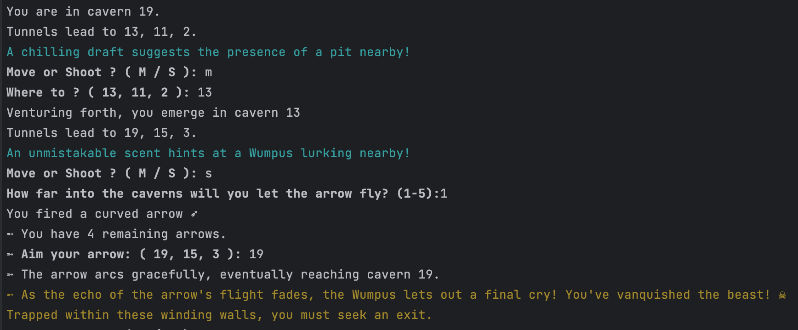

# Wumpus
This is a vanilla go implementation of the 1973 classic text-based computer game first developed by Gregory Yob [Hunt The Wumpus](https://en.wikipedia.org/wiki/Hunt_the_Wumpus).  
It includes all the levels from **Wumpus II**, mechanisms from **Wumpus III** and **Super Wumpus** as well as an advanced mode.

### Gameplay:

1. **The Cave System**: The game is played in a series of interconnected caves arranged in different predefined shapes. 


2. **Hazards**:
   - **The Wumpus**: This is the main antagonist of the game. If you enter the Wumpus's cave, you may get eaten and lose the game. Or the Wumpus may get disturbed and move to another cave.
     * At the start of the game, the Wumpus is deep asleep and won't move.
   - **Pits**: There are two pits in the cave system. Falling into a pit results in instant death.
   - **Giant Bats**: There are two caves with giant bats. If you enter a cave with a giant bat, you will be carried off to a random cave, which might be dangerous.
   - **Anaerobic Termite**: A colony of flying termites that loves to eat wooden arrows. If you enter the cavern the colony is occupying, it will eat one of your arrows. It might even eat your arrow in flight!


3. **Player Actions**: On each turn, you can choose to:
   - **Move**: To one of the three connected caves.
   - **Shoot**: You can shoot an arrow into one of the adjacent caves in hopes of killing the Wumpus. You start with 5 arrows. The arrow can travel up to 5 rooms. Shooting the Wumpus successfully means you win. Missing the Wumpus usually cause it to wake up or move to a random cave (if already woken up). Be careful of not hitting yourself with the arrow !
   

4. **Hints**: The game provides hints based on which cave the player is in:
   - **"An unmistakable scent hints at a Wumpus lurking nearby!"**: This means the Wumpus is in one of the adjacent caves.
   - **"A chilling draft suggests the presence of a pit nearby!"**: This indicates that one of the connected caves has a pit.
   - **"The distant fluttering of bats reaches your ears!"**: This suggests that giant bats are in an adjacent cave.
   - **"A faint quivering emanates from your quiver. Termites must be close."**: This means that a termite colony is in a nearby cave.
   - Various hints will also tell you when enemies or dangers are changing position.


5. **Migrations**: Hazards and enemies have a small chance to move randomly between caverns!
   - **Bats, Pits and Termites** will move randomly.
   - **The Wumpus** will move over to once adjacent cavern (if it's not sleeping).


6. **Winning and Losing**:
   - **Winning**: The player wins by shooting the Wumpus without falling into a pit or being eaten.
   - **Losing**: The player loses by getting struck by an arrow, falling into a pit, or being eaten by the Wumpus.  
   When losing, you restart at the same level you were on.


7. **Levels Topology**:  
   Levels are often 3D shapes flattened to 2d and thus, can be hard to visualize. See the `levels` folder for 2D renders (but forget the numbers you see on the graph, they are randomized!) or better yet, try to map them !
   - **1**: Is a [flattened dodecahedron](https://people.math.sc.edu/Burkardt/data/grf/dodecahedron.png) with 20 caverns. Each of the 20 caves is connected to three other caves.
   - **2**: Is a [moebius strip](https://en.wikipedia.org/wiki/M%C3%B6bius_strip) with 20 caverns.
   - **3**: String of beads: five beads in a circle, each bead is a diamond with a vertical cross-bar. The right & left corners lead to neighboring beads. (this one is difficult to play).
   - **4**: Hex Network : imagine an hexagonal tile floor. Take a rectangle with 20 points (intersections) inside (4x4). Join right & left side to make a cylinder, then join top & bottom to form a torus.
   - **5**: Is a Dendrite-like cave with a branching pattern and a lot of dead-ends. Susceptible to severance by pits, you might need to shoot in the unknown to make the Wumpus move! 
   - **6**: One-way lattice : Is a grid of one-way tunnels. Each cavern is connected to 2 other cavern. Be careful or you might need to loop around !
   - **7**: Is a [toroidal polyhedron](https://en.wikipedia.org/wiki/Toroidal_polyhedron).
   - **custom**: Do your own level ! See bellow.  


8. **Advanced**:
   - In advanced mode, you must kill the wumpus then find your way out of the level by finding a key and its door!
   - Various objects (ropes, repellent, shield...) will help you defend yourself against enemies and dangers !
   - You might also find clues about the cave system or location of objects...

### Custom
You can create you on levels by adding files to `labyrinth/levels/`. (see `example.json`)  
Give them a non-taken number in the `level` field, then add the caverns and tunnels in the `rooms` array.  
Each cavern is represented by an `id` which start at 0, and has a list of `edges` (one-way tunnels) which connect it to other rooms.
* _A room with no edge will be impossible to get out of._
* _A room can have a tunnel to itself._
* _If you want to connect 2 rooms in both direction, each should have an edge to the other_  

You can also specify the starting position and numbers of a lot of components of the game. (Be sure to have enough rooms for them, some can't coexist on the same room!)

**Notes**: Small differences with the original game :  
You can move directly by inputting a direction at the `Move or Shoot` question (input `m 8` or `8` or `m8`) .  
A startled Wumpus would only move 1 cave, which was kind of easier (to relocate) but less forgetful (it would have a 1/3 chance of eating you unless you backtracked 1 room).  
Possible paths for the arrow weren't displayed, maybe because of computing requirements/space.  
I lowered the chances of hazards moving (and probably will lower it further).

Pen & paper are recommended to take notes or draw the map !
While the layout remains fixed, the numbers by which the caverns are named do not follow a particular logic (i.e cavern 1 may not be connected to cavern 2).

### Running the game
```
go run .
```
Type `exit` any time to close the game.  
Type `reset` any time to restart from the first level.  
Type `seed` to get the seed used for randomness (debug purpose).

There a various flags available :  
`-advanced=false`: disable advanced mode (play exactly as the original game).  
`-wump3=false`: disable Wumpus III features (Anaerobic Termite, earthquakes & migrations)  
`-nodelay`: run the game without the fake terminal delay.  
`-clean`: remove symbols/colors (in case your terminal is broken, or you want that oldschool feeling)  
`-level=x`: start at a specific level (1-6).  
`-arrows`: gives infinite arrows.  
`-seed=xxxx`: set all the randomness based on the seed for debug purpose.  
`-debug`: cheat/debug mode.  




### TODO:
* Probably a few refactors of the state machine.
* Checks & reroll of pits location on maps where that could be impossible to solve (`5` and `6` only ?). Might be not needed with Wumpus' 3 features.
* bubble-up the few possibles IO errors
* Tests

Original source code on [archive.org](https://archive.org/details/CreativeComputingv01n05SeptemberOctober1975/page/n51/mode/2up) !

